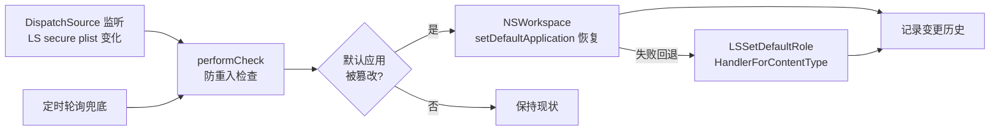

# Duty

macOS 菜单栏小工具：把文件扩展名「锁定」到你指定的默认应用，其他应用（或系统更新）偷偷改掉关联时自动恢复。选择要保护的扩展名 → 指定默认应用 → 打开锁定 → 被篡改自动还原并记录历史。

⬇️ **下载地址**：<https://github.com/ygnstudio/Duty/releases>（`Duty.dmg`，挂载后拖入 `/Applications`）

🍺 **Homebrew**：`brew install --cask ygnstudio/ygn/duty`（见 [homebrew-ygn](https://github.com/ygnstudio/homebrew-ygn)）

## 功能特性

- **锁定默认应用**：为任意扩展名指定默认打开应用（如 `.md` → Obsidian、`.pdf` → 预览、`.json` → VS Code），只保护你选的类型，不管全系统。
- **篡改即时检测**：DispatchSource 直接监听 Launch Services secure plist 文件变化，有改动即刻检查，定时轮询兜底，恢复接近实时。
- **文件级保护**：清除单个文件的「始终打开方式」覆盖（`com.apple.LaunchServices.OpenWith` xattr），让它重新跟随全局默认。
- **内置类型目录**：60+ 常见文件类型，中英文名称，搜索即加，不必手敲扩展名。
- **变更历史**：每次篡改与恢复都有记录，谁在什么时间改了什么、何时被还原，一目了然。
- **菜单栏驻留**：无 Dock 图标，支持登录自启；关掉主窗口保护不中断，从菜单退出才完全停止。
- **双语界面**：简体中文 / English，默认跟随系统，可手动切换。

## 运行要求

- macOS 14（Sonoma）及以上。
- 零第三方依赖 —— 全部走系统 Launch Services API。

### 可选增强：duti

[duti](https://github.com/moretension/duti) 仅用于识别系统自身无法解析的冷门扩展名（`UTType` 查不到 UTI 时兜底），绝大多数用户用不到：

```bash
brew install duti
```

未安装时若添加未注册扩展名，App 内会给出安装引导；也可随时在 **设置 → 增强组件** 中安装。

## 目录结构

```
Duty/
├── build_app.sh                    # 一键打包脚本（swift build → Duty.app）
├── Package.swift
├── AppIcon.icns
├── Sources/Duty/
│   ├── DutyApp.swift               # App 入口（菜单栏 + 主窗口）
│   ├── AppState.swift              # 全局状态（Combine 转发子服务变化）
│   ├── Models/                     # 数据模型（关联 / 历史 / 受管文件）
│   ├── Services/
│   │   ├── AssociationService.swift     # UTI 解析 + 默认应用读写
│   │   ├── ProtectionService.swift      # plist 监听 + 篡改检测 + 自动恢复
│   │   ├── ExtensionCatalog.swift       # 内置文件类型目录
│   │   ├── CommandRunner.swift          # 安全的子进程执行
│   │   ├── DutiDetector.swift           # duti 可选组件检测
│   │   └── PersistenceController.swift  # 本地 JSON 持久化
│   ├── Views/                      # SwiftUI 视图（列表 / 历史 / 设置 / 引导页）
│   ├── Utilities/
│   └── Resources/                  # 内置 JSON 目录 + 中英 Localizable.strings
└── .github/workflows/
    └── build.yml                   # tag 触发：构建 → 打包 DMG → 发布 Release
```

## 工作原理

「锁定」是**检测-恢复**式的，不是系统级阻止 —— Duty 监听 Launch Services 配置变化，发现关联被抢走就立刻改回来：



- **读取**：直接解析 `~/Library/Preferences/com.apple.LaunchServices/com.apple.launchservices.secure.plist` 的 LSHandlers（绕开 launchservicesd 滞后的分层缓存），`LSCopy` API 仅作回退。
- **写入**：优先 `NSWorkspace.setDefaultApplication(at:toOpen:)`（触发系统确认框，走正规系统路径），失败回退到低层 LS API。
- **duti 的角色**：只在 `UTType` 解析失败时用于冷门扩展名的 UTI 兜底，不参与读写。

## 使用方式

1. 点击菜单栏的**盾牌图标**打开主窗口。
2. **添加文件类型**，搜索要管理的扩展名。
3. 为每个扩展名选择默认应用。
4. 打开**锁定**开关，启用自动保护。
5. 关闭窗口 App 继续后台运行，保护不中断。

| 操作 | 行为 |
|------|------|
| 左键菜单栏图标 | 打开 / 聚焦主窗口 |
| 右键菜单栏图标 | 打开或退出 |
| 关闭主窗口 | 继续后台运行（保护生效） |
| 菜单退出 | 完全退出（保护停止） |

## 从源码构建

```bash
git clone https://github.com/ygnstudio/Duty.git
cd Duty
./build_app.sh   # 生成 Duty.app
open Duty.app
```

或用 Xcode 打开 `Package.swift` 按 `⌘R`。

## License

MIT —— 详见 [LICENSE](LICENSE)。
